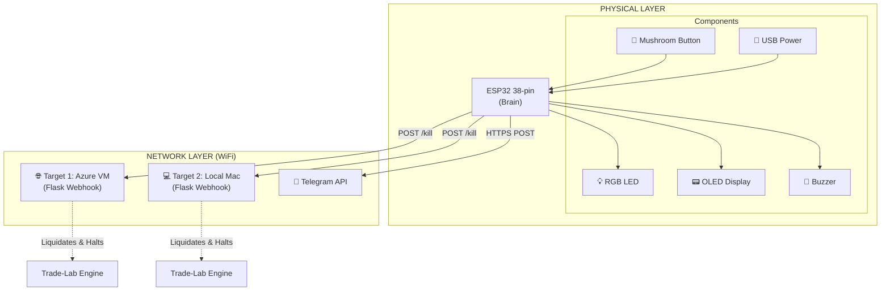
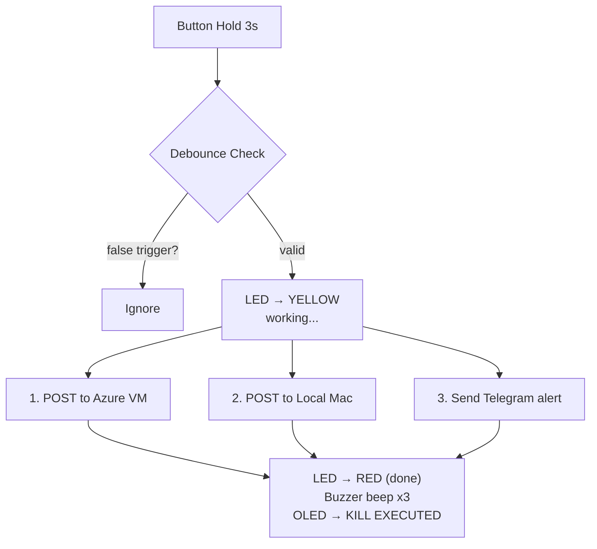

# ⛔ ESP32 Trading Kill Switch (Phase 2)

A physical hardware emergency stop for trading bots and automated trading systems. One button press cancels all open orders, closes all positions, stops the bot, and sends an instant alert — even if the software is frozen or unresponsive.

> **Status:** ✅ Phase 2 Complete (Dual-Target Webhook Integration)
> 
> *Note: This kill switch is tailored for integration with the "Trade-Lab" bot, utilizing a companion Flask server to handle emergency liquidations.*

---

## 📖 Deep Dive

Curious about how it works under the hood? Check out the **[Engineering Showcase](docs/showcase.md)** for a deep dive into the security, non-volatile memory, and async dashboard implementation.

---

## 🛑 Why this exists

Automated trading systems can behave unexpectedly — runaway bots, API misfires, flash crashes, or network issues can cause rapid unintended losses. Software-only kill switches fail when the software itself is the problem.

This device is **hardware-first**: a physical button that independently connects to companion Webhook APIs over WiFi to execute an emergency shutdown sequence, completely bypassing your trading bot's core decision loop.

---

## 🚀 What it does

When the emergency button is pressed and held for 3 continuous seconds:

1. ⚡ **Sends an HTTP POST** to your configured companion servers (Azure VM, Local Mac, or both).
2. 📉 **Liquidates all open positions** instantly via the companion server's `PaperBroker` module.
3. 🛑 **Writes a persistent kill flag** (`data/KILL_ACTIVE`) to the server disk. The main bot reads this flag and halts all trading.
4. 📲 **Sends a Telegram alert** directly from the hardware with the execution status.
5. 🔴 **LED + buzzer** confirm the action was executed.

---

## 🏛️ System Architecture



---

## ⚙️ Trigger Sequence



---

## 🧰 Hardware Components

| Component | Spec | Purpose |
|---|---|---|
| ESP32 Dev Board | 38-pin, ESP-WROOM-32 | Main controller, WiFi, Web Server |
| Lever / Mushroom Switch | 2-pin | Physical kill button |
| OLED Display | 0.96", I2C, SSD1306, 128×64 | Status display |
| RGB LED | 5mm, common cathode | Visual status indicator |
| Active Buzzer | 3.3V, Active LOW logic | Audio confirmation |
| Resistors | 220Ω × 3, 10kΩ × 1, ¼W 5% | LED limiting, pull-up |
| USB Data Cable | Must support data transfer | Flashing & Power |

See [`hardware/components_list.md`](hardware/components_list.md) for full details and important purchasing warnings.

---

## 🔌 Pin Mapping (ESP32 38-pin)

| GPIO | Connected To | Mode |
|---|---|---|
| GPIO 4 | Emergency stop button | INPUT + 10kΩ pull-up |
| GPIO 18 | Buzzer | OUTPUT |
| GPIO 15 | RGB LED — Red | OUTPUT (PWM) |
| GPIO 16 | RGB LED — Green | OUTPUT (PWM) |
| GPIO 21 | OLED SDA | I2C |
| GPIO 22 | OLED SCL | I2C |
| 3.3V | Resistors, LED, OLED VCC | Power |
| GND | All grounds | Ground |

---

## 💻 Software Stack

- **Firmware:** Arduino IDE (C++) on ESP32 (`v2` branch)
- **API Targets:** Flask server (`kill_server.py`) running in Trade-Lab.
- **Alerts:** Telegram Bot API
- **ESP32 Libraries:**
  - `WiFiClientSecure` & `HTTPClient` — HTTPS API connections
  - `WebServer` — Embedded dark-mode UI
  - `Preferences` — NVS storage for target toggles
  - `Adafruit_SSD1306` — OLED display

---

## 🔒 Security

- **Authentication:** The ESP32 signs webhook payloads with an `X-Kill-Token` stored in its flash memory to prevent unauthorized curls.
- **Persistent Memory:** Target preferences are saved to Non-Volatile Storage (NVS).
- **Physical Safety:** 3-second hold prevents accidental triggers, backed by hardware debounce.
- **Secrets:** WiFi credentials and API tokens are stored in `secrets.h` (never committed).

---

## 📁 Project Structure

```
esp32-trading-killswitch/
│
├── firmware/
│   ├── killswitch_esp32_v1/    # Legacy (Local delays only)
│   └── killswitch_esp32_v2/    # Phase 2 (WiFi + Dashboard + Webhooks)
│       ├── killswitch_esp32_v2.ino
│       └── secrets.h.example   # Template for credentials
│
├── hardware/
│   └── components_list.md      # Shopping list with prices and tips
│
├── docs/
│   ├── setup.md                # Full setup & build guide
│   ├── showcase.md             # Deep dive engineering showcase
│   └── phase2_plan.md          # Architectural planning notes
│
├── .gitignore
└── README.md
```

---

## 🛠️ Setup

Ready to build your own? See **[`docs/setup.md`](docs/setup.md)** for complete, step-by-step instructions covering:
- Arduino IDE setup for ESP32
- Setting up the Python companion server
- Creating `secrets.h`
- Flashing the firmware
- Hardware wiring

---

## 📜 License

MIT — use freely, trade responsibly.

---

> ⚠️ **Disclaimer:** This is a personal hardware project. Always test thoroughly on paper trading before using with real capital. The author is not responsible for trading losses.
