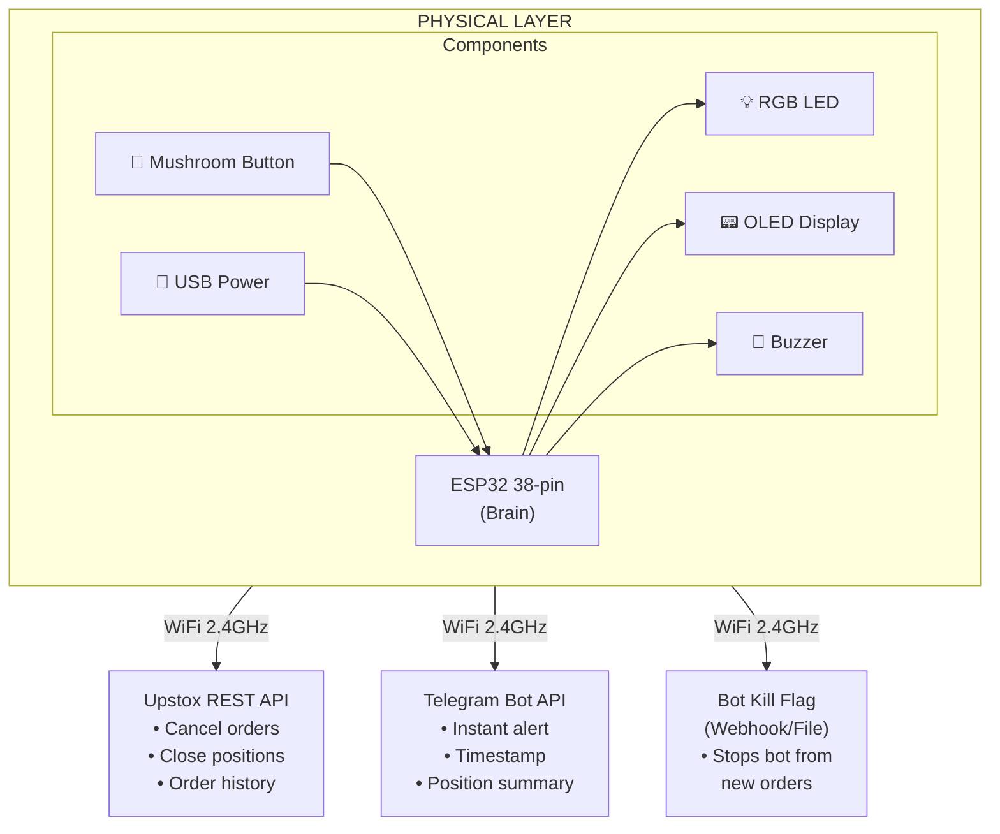
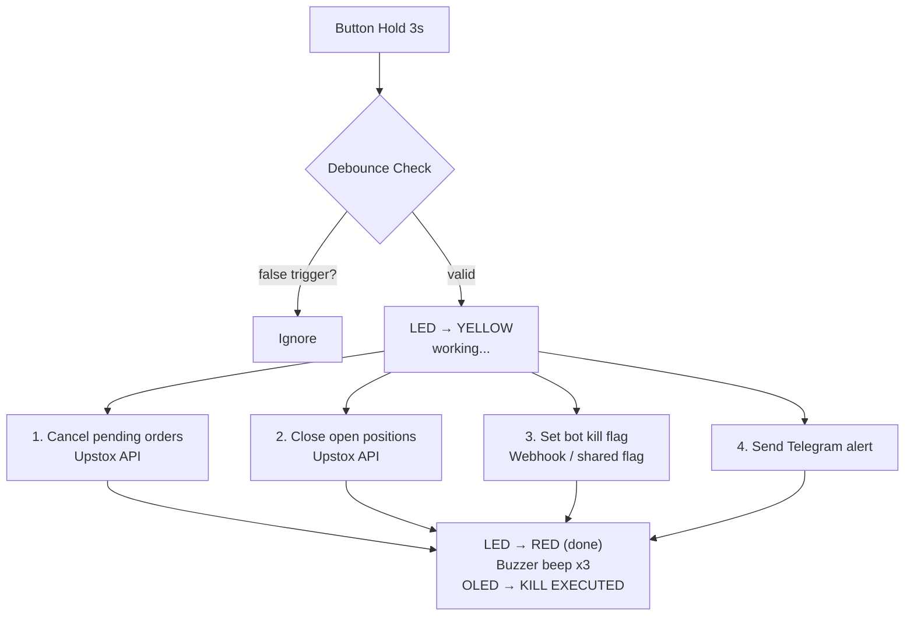

# ⛔ ESP32 Trading Kill Switch

A physical hardware emergency stop for trading bots and automated trading systems. One button press cancels all open orders, closes all positions, stops the bot, and sends an instant alert — even if the software is frozen or unresponsive.

> **Status:** 🚧 In Development — Paper trading phase (Upstox)
> 
> *Note: While designed as a generic safety switch, the current phase is tailored for integration with the "Trade-Lab" bot.*

---

## Why this exists

Automated trading systems can behave unexpectedly — runaway bots, API misfires, flash crashes, or network issues can cause rapid unintended losses. Software-only kill switches fail when the software itself is the problem.

This device is **hardware-first**: a physical button that independently connects to the broker API over WiFi and executes an emergency shutdown sequence, completely bypassing your trading bot process.

---

## What it does

When the emergency button is pressed and held for 3 seconds:

1. ⛔ **Cancels all open/pending orders** via Upstox REST API
2. 📉 **Closes all open positions** (places opposing market orders)
3. 🛑 **Sends a kill signal** to stop the trading bot from placing new orders
4. 📲 **Sends a Telegram alert** with timestamp and position summary
5. 🔴 **LED + buzzer** confirm the action was executed

---

## System Architecture



---

## Trigger Sequence



---

## Hardware Components

| Component | Spec | Purpose |
|---|---|---|
| ESP32 Dev Board | 38-pin, ESP-WROOM-32 | Main controller, WiFi |
| Mushroom Emergency Stop | 22mm, NO+NC, latching | Physical kill button |
| OLED Display | 0.96", I2C, SSD1306, 128×64 | Status display |
| RGB LED | 5mm, common cathode | Visual status indicator |
| Active Buzzer | 3.3V, 12mm | Audio confirmation |
| Resistors | 220Ω × 3, 10kΩ × 1, ¼W 5% | LED limiting, pull-up |
| ABS Enclosure | ~100×68×50mm | Housing |
| USB 5V adapter | 1A | Power supply |

See [`hardware/components_list.md`](hardware/components_list.md) for full details and where to buy.

---

## Pin Mapping (ESP32 38-pin)

| GPIO | Connected To | Mode |
|---|---|---|
| GPIO 4 | Emergency stop button | INPUT + 10kΩ pull-up |
| GPIO 18 | Buzzer | OUTPUT |
| GPIO 15 | RGB LED — Red | OUTPUT |
| GPIO 16 | RGB LED — Green | OUTPUT |
| GPIO 21 | OLED SDA | I2C |
| GPIO 22 | OLED SCL | I2C |
| 3.3V | Resistors, LED, OLED VCC | Power |
| GND | All grounds | Ground |

---

## Software Stack

- **Firmware:** Arduino IDE (C++) on ESP32
- **Broker API:** Upstox REST API v2
- **Alerts:** Telegram Bot API
- **Libraries:**
  - `WiFiClientSecure` — HTTPS connections
  - `HTTPClient` — REST API calls
  - `Adafruit_SSD1306` — OLED display
  - `ArduinoJson` — JSON parsing

---

## Security

- API tokens stored in `secrets.h` (never committed — see `.gitignore`)
- 3-second hold prevents accidental triggers
- Button uses hardware debounce (10kΩ pull-up + 50ms software debounce)
- Works independently of trading bot process — hardware bypass

---

## Project Structure

```
esp32-trading-killswitch/
│
├── firmware/
│   ├── killswitch_esp32_v1/killswitch_esp32_v1.ino # Main Arduino sketch
│   └── secrets.h.example       # Template for credentials
│
├── hardware/
│   ├── wiring_diagram.png      # Full circuit diagram (Coming soon)
│   └── components_list.md      # Shopping list with prices
│
├── docs/
│   ├── setup.md                # Full setup guide
│   ├── architecture.md         # Detailed architecture notes
│   └── upstox_api_notes.md     # Upstox API reference used
│
├── .gitignore
└── README.md
```

---

## Setup

See [`docs/setup.md`](docs/setup.md) for complete step-by-step instructions covering:
- Arduino IDE setup for ESP32
- Upstox API credentials
- Telegram bot creation
- Flashing the firmware
- Hardware wiring

---

## Broker

Currently configured for **[Upstox](https://upstox.com/)** (paper trading phase).

API endpoints used:
- `GET /v2/portfolio/positions` — fetch open positions
- `DELETE /v2/orders` — cancel all pending orders
- `POST /v2/order/place` — place closing market orders

---

## Roadmap

- [x] Project initialized
- [x] Hardware components purchased
- [x] Breadboard prototype wired
- [x] Basic button → LED firmware
- [ ] WiFi + Upstox API integration
- [ ] Telegram alert integration
- [ ] Bot kill flag / webhook
- [ ] Enclosure build
- [ ] Move to live trading

---

## License

MIT — use freely, trade responsibly.

---

> ⚠️ **Disclaimer:** This is a personal hardware project. Always test thoroughly on paper trading before using with real capital. The author is not responsible for trading losses.
