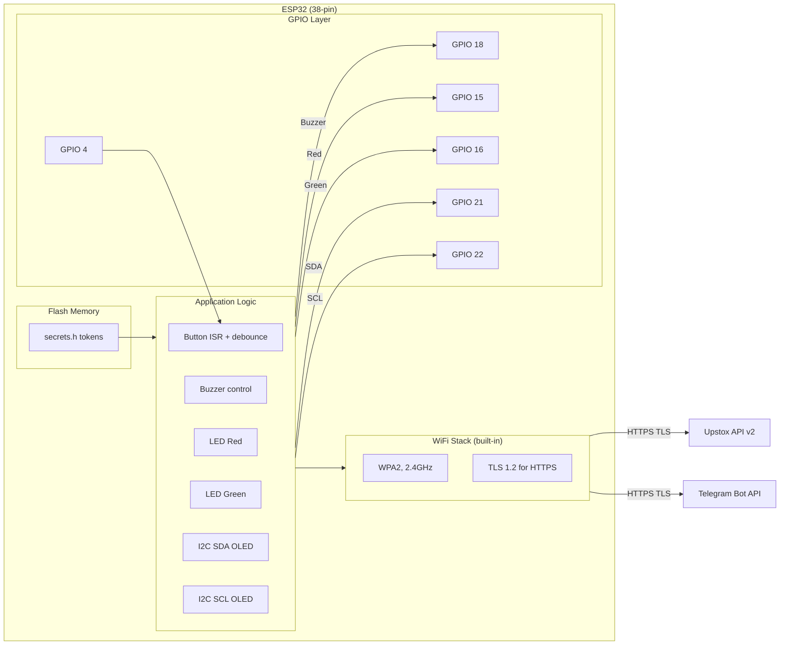
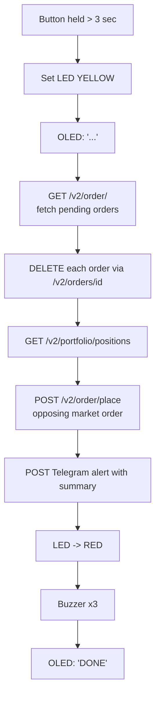

# Architecture

Detailed design decisions and system architecture for the ESP32 Trading Kill Switch.

---

## Design Philosophy

### Hardware-first safety
The kill switch is intentionally a **separate physical device** from the trading bot. This means:

- If the trading bot process crashes or freezes → kill switch still works
- If the laptop running the bot loses power → kill switch (on USB adapter) still works
- If the bot's network stack has issues → kill switch uses its own WiFi connection
- No shared process, no shared memory, no shared network socket

This is the key difference from a software kill switch. The hardware layer is the last line of defense.

### 3-second hold requirement
A single button press does NOT trigger the kill sequence. The button must be held for **3 continuous seconds**. This prevents:
- Accidental brushing of the button
- Bumping the device
- False triggers from electrical noise

The OLED counts down during the hold so you know it's registering.

---

## Component Architecture



---

## Kill Sequence - Detailed Flow



---

## LED Status Codes

| Color | Meaning |
|---|---|
| 🟢 Green | Armed, WiFi connected, ready |
| 🟡 Yellow (blinking) | Connecting to WiFi on boot |
| 🟡 Yellow (solid) | Kill sequence executing |
| 🔴 Red | Kill executed successfully |
| 🔴 Red (fast blink) | Error - API call failed |
| Off | No power |

---

## Upstox API Endpoints Used

| Action | Method | Endpoint |
|---|---|---|
| Get open positions | GET | `/v2/portfolio/short-term-positions` |
| Get pending orders | GET | `/v2/orders` |
| Cancel a specific order | DELETE | `/v2/orders/{order_id}` |
| Place closing order | POST | `/v2/order/place` |

All calls use:
- Base URL: `https://api.upstox.com`
- Header: `Authorization: Bearer {access_token}`
- Header: `Content-Type: application/json`
- TLS via `WiFiClientSecure`

---

## Bot Kill Signal

The kill switch signals your trading bot to stop placing new orders via one of two methods (choose based on your bot's architecture):

### Option A - Shared file flag (simplest)
The ESP32 calls a lightweight webhook on your local machine or server that writes a file:
```
/tmp/TRADING_KILL_ACTIVE
```
Your bot checks for this file at the start of each trade cycle and exits if it exists.

### Option B - HTTP webhook
Your trading bot exposes a local endpoint:
```
POST http://your-bot-server:8080/kill
```
The ESP32 calls this endpoint. Your bot shuts down its order loop on receipt.

### Option C - MQTT (advanced)
Both the ESP32 and bot subscribe to an MQTT broker. ESP32 publishes `kill` to a topic; bot subscribes and halts.

**Recommended for paper trading phase:** Option A (simplest, no extra infra).

---

## Security Considerations

### What's in secrets.h (never commit)
```
WIFI_SSID
WIFI_PASSWORD
UPSTOX_ACCESS_TOKEN
TELEGRAM_BOT_TOKEN
TELEGRAM_CHAT_ID
```

### Token storage
Tokens are stored in ESP32 flash memory via `secrets.h` compiled into firmware. For production, consider using ESP32's NVS (Non-Volatile Storage) with encryption.

### Physical security
The device should be:
- Within arm's reach of the trader at all times
- In a clearly labelled enclosure (RED label: "EMERGENCY STOP")
- Never left unattended in a public space (WiFi credentials are in flash)

---

## Future Improvements

- [ ] Auto-refresh Upstox access token (OAuth refresh flow)
- [ ] Battery backup (Li-Po + TP4056 module) so it works during power cuts
- [ ] Second confirmation button (two-button press = kill) for extra safety
- [ ] SD card logging of all kill events with timestamps
- [ ] Web dashboard (ESP32 hosts a tiny web server) to see status
- [ ] Support for multiple brokers (Zerodha, Angel One)
- [ ] OTA (Over-the-Air) firmware updates
