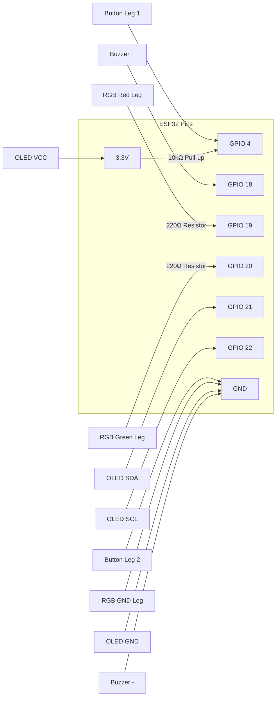

# Setup Guide

Complete step-by-step instructions to go from zero to a working kill switch.

---

## Prerequisites

- Arduino IDE 2.x installed on your laptop
- A GitHub account (repo already initialized)
- Upstox account with API access (paper trading is fine)
- A Telegram account

---

## Step 1 — Arduino IDE: Add ESP32 Support

1. Open Arduino IDE → **File → Preferences**
2. In "Additional Boards Manager URLs" paste:
   ```
   https://raw.githubusercontent.com/espressif/arduino-esp32/gh-pages/package_esp32_index.json
   ```
3. Go to **Tools → Board → Boards Manager**
4. Search `esp32` → Install **"esp32 by Espressif Systems"**
5. After install, go to **Tools → Board → ESP32 Arduino → ESP32 Dev Module**

---

## Step 2 — Install Required Libraries

Go to **Tools → Manage Libraries** and install:

| Library | Author |
|---|---|
| `Adafruit SSD1306` | Adafruit |
| `Adafruit GFX Library` | Adafruit |
| `ArduinoJson` | Benoit Blanchon |

`WiFiClientSecure` and `HTTPClient` are built into the ESP32 Arduino core — no install needed.

---

## Step 3 — Upstox API Setup

1. Log in at [upstox.com](https://upstox.com) → **My Account → API**
2. Create a new app:
   - App name: `killswitch`
   - Redirect URI: `http://localhost` (for paper trading)
3. Note down your **API Key** and **API Secret**
4. Generate an **Access Token** using the Upstox OAuth flow
5. Copy the access token — you'll put this in `secrets.h`

> Access tokens expire daily. For paper trading this is fine — you'll manually refresh. A future improvement will handle auto-refresh.

---

## Step 4 — Telegram Bot Setup

1. Open Telegram → search for `@BotFather`
2. Send `/newbot` → follow prompts → give it a name
3. BotFather gives you a **Bot Token** — save it
4. Start a conversation with your new bot
5. Get your **Chat ID**:
   - Go to: `https://api.telegram.org/bot<YOUR_TOKEN>/getUpdates`
   - Send any message to the bot first
   - Look for `"chat":{"id":XXXXXXX}` in the response
6. Save the Chat ID

---

## Step 5 — Configure secrets.h

1. Copy `firmware/secrets.h.example` → rename to `firmware/secrets.h`
2. Fill in your values:

```cpp
// WiFi
#define WIFI_SSID       "your_wifi_name"
#define WIFI_PASSWORD   "your_wifi_password"

// Upstox
#define UPSTOX_ACCESS_TOKEN  "your_upstox_access_token"

// Telegram
#define TELEGRAM_BOT_TOKEN   "123456789:ABCdef..."
#define TELEGRAM_CHAT_ID     "your_chat_id"
```

3. Confirm `secrets.h` is in `.gitignore` before committing anything

---

## Step 6 — Wire the Hardware

Refer to `hardware/wiring_diagram.png` for the full diagram.

Quick reference:



---

## Step 7 — Flash the Firmware

1. Plug ESP32 into laptop via USB
2. Open `firmware/killswitch.ino` in Arduino IDE
3. Select the correct port: **Tools → Port → COMX** (Windows) or `/dev/ttyUSB0` (Linux/Mac)
4. Select board: **Tools → Board → ESP32 Dev Module**
5. Click **Upload** (→ arrow button)
6. Open Serial Monitor (115200 baud) to see debug output

---

## Step 8 — Test

1. Power on the device
2. OLED should show: `ARMED — WiFi OK`
3. LED should be **GREEN** (armed and ready)
4. Hold the button for 3 seconds
5. Expected sequence:
   - LED → YELLOW (executing)
   - Serial monitor shows API call responses
   - LED → RED (done)
   - Buzzer beeps 3 times
   - Telegram message received
   - OLED shows: `KILL EXECUTED`

---

## Troubleshooting

| Symptom | Likely cause | Fix |
|---|---|---|
| OLED blank | Wrong I2C address | Try `0x3C` or `0x3D` in code |
| WiFi won't connect | Wrong credentials | Check `secrets.h` SSID/password |
| API call fails | Expired token | Refresh Upstox access token |
| Button triggers instantly | Floating pin | Check 10kΩ pull-up wiring |
| No Telegram message | Wrong chat ID | Redo Step 4 to get correct ID |
| Upload fails | Wrong COM port | Check Device Manager for correct port |
