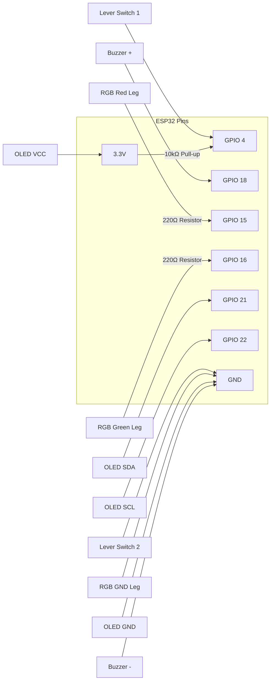

# Setup Guide

Complete step-by-step instructions to go from zero to a working Phase 2 kill switch.

---

## Prerequisites

- Arduino IDE 2.x installed on your laptop
- A GitHub account (repo already initialized)
- The Trade-Lab Python bot environment (which contains `kill_server.py`)
- A Telegram account

---

## Step 1 — Arduino IDE: Add ESP32 Support

1. Open Arduino IDE → **File → Preferences**
2. In "Additional Boards Manager URLs" paste:
   ```
   https://raw.githubusercontent.com/espressif/arduino-esp32/gh-pages/package_esp32_index.json
   ```
3. Go to **Tools → Board → Boards Manager**
4. Search `esp32` → Install **"esp32 by Espressif Systems"**
5. After install, go to **Tools → Board → ESP32 Arduino → ESP32 Dev Module**

---

## Step 2 — Install Required Libraries

Go to **Tools → Manage Libraries** and install:

| Library | Author |
|---|---|
| `Adafruit SSD1306` | Adafruit |
| `Adafruit GFX Library` | Adafruit |

*(Note: `WiFi`, `WiFiClientSecure`, `HTTPClient`, `WebServer`, and `Preferences` are built into the ESP32 Arduino core — no separate installation needed).*

---

## Step 3 — Trade-Lab Webhook Server Setup

The Phase 2 kill switch relies on a Python companion server running alongside your trading bots.

1. Navigate to your `Trade-Lab` project repository.
2. Ensure you have the `.env` file configured with a `KILL_SECRET` (a strong password).
3. Start the Flask server on your Azure VM and/or Local Mac:
   ```bash
   python kill_server.py
   ```
4. By default, it runs on port `5050`. Note the IP addresses of your Azure VM and Local Mac. You will need these for Step 5.

---

## Step 4 — Telegram Bot Setup

1. Open Telegram → search for `@BotFather`
2. Send `/newbot` → follow prompts → give it a name
3. BotFather gives you a **Bot Token** — save it.
4. Start a conversation with your new bot (send it a message like "hello").
5. Get your **Chat ID**:
   - Go to: `https://api.telegram.org/bot<YOUR_TOKEN>/getUpdates`
   - Look for `"chat":{"id":XXXXXXX}` in the JSON response.
6. Save the Chat ID.

---

## Step 5 — Configure secrets.h

Your WiFi credentials, webhook URLs, and Telegram tokens must be hardcoded into the ESP32 flash memory for security.

1. Navigate to `firmware/killswitch_esp32_v2/`
2. Copy `secrets.h.example` → rename to `secrets.h`
3. Fill in your exact values:

```cpp
// ── WiFi ─────────────────────────────────────────────────────
#define WIFI_SSID         "Your_WiFi_Name"
#define WIFI_PASSWORD     "Your_WiFi_Password"

// ── Azure VM ─────────────────────────────────────────────────
#define AZURE_KILL_URL    "http://<AZURE_IP>:5050/kill"
#define AZURE_HEALTH_URL  "http://<AZURE_IP>:5050/health"
#define AZURE_RESET_URL   "http://<AZURE_IP>:5050/reset"

// ── Local Mac ────────────────────────────────────────────────
#define LOCAL_KILL_URL    "http://<LOCAL_IP>:5050/kill"
#define LOCAL_HEALTH_URL  "http://<LOCAL_IP>:5050/health"
#define LOCAL_RESET_URL   "http://<LOCAL_IP>:5050/reset"

// ── Telegram ─────────────────────────────────────────────────
#define TELEGRAM_BOT_TOKEN  "123456789:ABCdef..."
#define TELEGRAM_CHAT_ID    "987654321"

// ── Security ─────────────────────────────────────────────────
// Must match the KILL_SECRET in your Trade-Lab .env file
#define KILL_SECRET "my_super_secret_kill_token_123"
```

> **Warning:** Confirm `secrets.h` is in your `.gitignore` file before committing anything to GitHub!

---

## Step 6 — Wire the Hardware

Refer to the diagram below for wiring. A full schematic will be added soon.



*(For specific purchasing warnings, see [components_list.md](../hardware/components_list.md)).*

---

## Step 7 — Flash the Firmware

1. Plug the ESP32 into your laptop via a **data-capable** USB cable.
2. Open `firmware/killswitch_esp32_v2/killswitch_esp32_v2.ino` in Arduino IDE.
3. Select the correct port: **Tools → Port → COMX** (Windows) or `/dev/cu.usbserial-XXXX` (Mac).
4. Select board: **Tools → Board → ESP32 Dev Module**.
5. Click **Upload** (the right-arrow button).
6. Open the **Serial Monitor** (set to `115200` baud) to observe the boot sequence.

---

## Step 8 — Test & Dashboard

1. **Boot**: Power on the device.
2. **WiFi**: The OLED will display "Connecting...". Once connected, it will show the IP address. The LED should turn **GREEN** (armed and ready).
3. **Web Dashboard**: 
   - Open a browser on your phone or laptop.
   - Go to `http://<ESP32_IP_ADDRESS>`
   - Ensure the Azure VM and Local Mac statuses read `ONLINE ✅`.
4. **Fire the Switch**:
   - Hold the physical lever switch for **3 continuous seconds**.
   - Watch the OLED countdown.
   - The LED will turn YELLOW.
   - If successful, the webhook targets will liquidate positions, the LED will turn RED, the buzzer will beep 3 times, and you will receive a Telegram message.
5. **Reset**:
   - Flip the lever switch back to its original position.
   - Click **Reset** on the Web Dashboard to re-arm the Trade-Lab bots.

---

## Troubleshooting

| Symptom | Likely cause | Fix |
|---|---|---|
| OLED blank / hangs on boot | Wrong I2C address | Try `0x3C` or `0x3D` in code. Check SDA/SCL wiring. |
| WiFi won't connect | Wrong credentials | Check `secrets.h` SSID/password. |
| Dashboard says OFFLINE | Wrong IP/Port in `secrets.h` | Check Azure/Local IPs and ensure `kill_server.py` is running on 5050. |
| Server returns 401 | Token mismatch | Ensure `KILL_SECRET` in `secrets.h` matches `.env`. |
| Button triggers instantly | Floating pin | Check 10kΩ pull-up wiring on GPIO 4. |
| No Telegram message | Wrong Chat ID | Redo Step 4 to verify the ID (often starts with a `-`). |
| Upload fails | Bad USB Cable | Ensure the cable supports Data (not just charge-only). |
