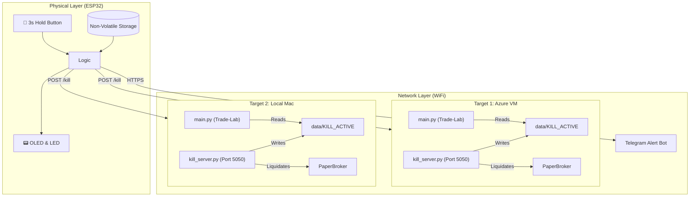

# 🛑 ESP32 Trading Kill Switch: Engineering Showcase

> [!NOTE] 
> **Hardware-First Safety**
> Software kill switches fail when the software itself crashes. This project engineers a physical, hardware-first solution. If the trading bot freezes, the network stack hangs, or the local machine crashes, this dedicated ESP32 device bypasses the failure points to liquidate positions and halt the system.

## 🌟 The Phase 2 Evolution

Phase 2 transforms the local prototype into a fully integrated, dual-target security appliance. It bridges physical hardware (ESP32) with a Python-based ecosystem (Trade-Lab), providing instantaneous, fail-safe liquidation capabilities across multiple deployment environments (Azure VM & Local Mac).

---

## 🏗️ High-Level Architecture

The system operates across three distinct layers: the **Physical Actuator** (ESP32), the **Companion API** (Flask Webhook), and the **Trading Engine** (Trade-Lab Bot).



---

## ⚡ The Kill Sequence

Safety systems must prevent accidental triggers. The switch requires a deliberate **3-second hold**. The OLED provides real-time countdown feedback. Once executed, a highly orchestrated shutdown sequence begins simultaneously across selected targets.

```mermaid
sequenceDiagram
    actor User
    participant ESP as ESP32 (Hardware)
    participant Srv as kill_server.py (Flask)
    participant PB as PaperBroker
    participant Bot as main.py
    participant Tel as Telegram API

    User->>ESP: Holds button (3 seconds)
    ESP->>ESP: State: ARMED -> COUNTDOWN -> EXECUTING
    
    ESP->>Srv: POST /kill (Header: X-Kill-Token)
    
    rect rgb(30, 41, 59)
    note right of Srv: Server-Side Execution
    Srv->>Srv: Verify Token & Check Spam Rate-Limit
    Srv->>Srv: Write 'data/KILL_ACTIVE' flag
    Srv->>PB: liquidate_all()
    PB-->>Srv: Positions flattened
    end
    
    Srv-->>ESP: 200 OK
    ESP->>Tel: POST /sendMessage (Hardware confirmation)
    Srv->>Tel: POST /sendMessage (Liquidation details)
    
    loop Every Trade Cycle
        Bot->>Bot: if is_killed(): return
        note right of Bot: Algorithmic trading halted
    end

    ESP->>ESP: State -> KILLED (Red LED, Buzzer)
```



---

## 🛡️ Security & Reliability Features

Building a production-grade kill switch required moving beyond simple HTTP requests. Phase 2 introduces enterprise-grade resilience.

> [!IMPORTANT]
> **Persistent State & Reboot Survival**
> The `data/KILL_ACTIVE` flag is saved to disk, not memory. If the Azure VM crashes and automatically reboots while the switch is active, `kill_server.py` detects the persistent flag on startup and immediately fires a critical Telegram alert warning that the bot is still halted.

### 1. `X-Kill-Token` Authentication
Endpoints are shielded from unauthorized network access. The ESP32 signs requests with a secret token stored in its flash memory.

```python
# kill_server.py
token = request.headers.get('X-Kill-Token', '')
if KILL_SECRET and token != KILL_SECRET:
    return jsonify({"error": "Unauthorized"}), 401
```

### 2. Dual-Target NVS Memory
The user can toggle which servers receive the kill signal (Azure, Local Mac, or both). The ESP32's `Preferences.h` saves this configuration to **Non-Volatile Storage (NVS)**, ensuring settings survive power cycles.

### 3. Immediate Liquidation Interface
The companion server doesn't just set a flag; it actively reaches into the Trade-Lab architecture to liquidate risk instantly, bypassing the bot's standard decision loop.

```python
# kill_server.py - Emergency Liquidation Block
from broker.paper_broker import PaperBroker
broker = PaperBroker()
if broker.positions:
    logging.warning(f"🚨 Liquidating {len(broker.positions)} open positions!")
    broker.liquidate_all()
```

---

## 🎛️ The Embedded Dashboard

The ESP32 hosts a stunning, dark-mode web dashboard. Accessible via its local IP, it acts as the mission control for the hardware switch.

> [!TIP]
> **Asynchronous Health Polling**
> The dashboard uses JavaScript to continuously ping the Azure and Local Mac servers behind the scenes, displaying real-time `ONLINE`, `OFFLINE`, or `BLOCKED` statuses without requiring page reloads.

### Dashboard Capabilities:
- **Live Diagnostics**: Checks the status of the remote kill servers and the local bot flags.
- **Dynamic Toggles**: Enable or disable target VMs on the fly.
- **Remote Reset**: Safely delete the `KILL_ACTIVE` flags and re-arm the Trade-Lab bots with a single click.
- **End-to-End Testing**: Fire a test Telegram message to verify connectivity without halting trades.

*(The entire HTML/CSS payload is served directly from the ESP32's memory buffer, requiring no external CDNs or internet access to render).*

---

## 🚀 Moving to Phase 3 (Live Capital)
Phase 2 perfects the network layer and webhook integration for **Paper Trading**. As Trade-Lab moves to real capital (Phase 3), the ESP32 firmware will be upgraded to route its `POST` requests directly to the **Upstox API**, creating an uncompromisable hardware shortcut to the exchange.
